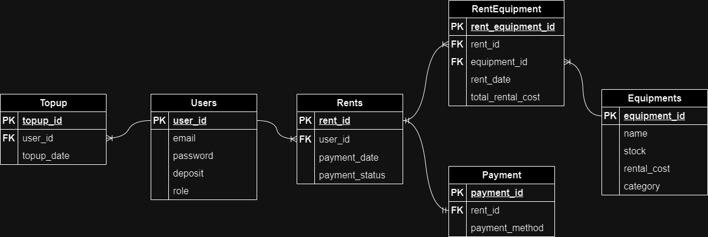

# Factura

An e-commerce RestAPI application for selling an equipments.
---
## Tech stacks
- Golang
- Echo
- JWT-Authorization
- REST
- Swagger
- Testify
- PostreSQL
- 3rd party APIs (Xendit and SendGrid)
---
## Features
- An user menu for register and login.
- A customer menu for get info customer, rents equipment, topup, payment, get all info equipment
- An admin menu with CRUD operations for equipment.

---
## ERD

---
## App Demo
>add later